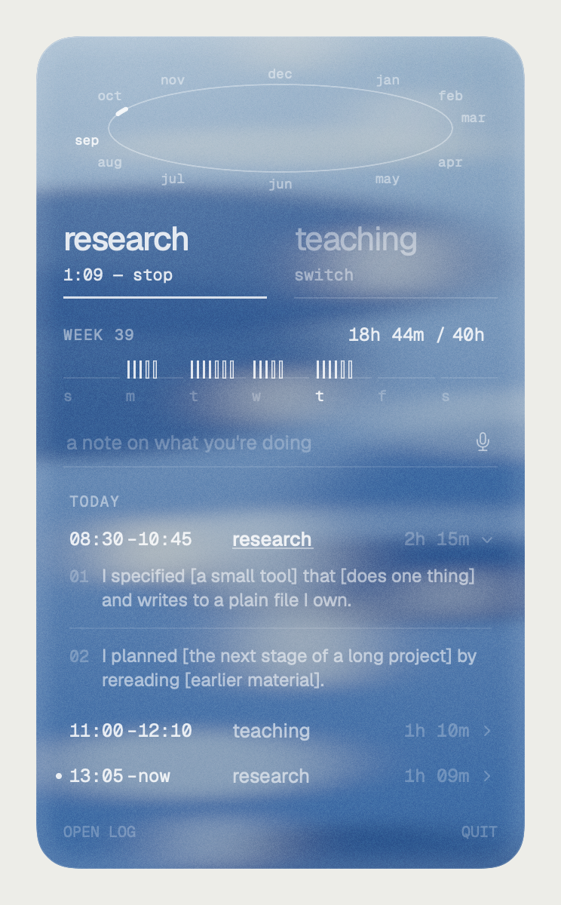

# Knolling

A menu-bar clock for research and teaching. Clock in and out as many times as the day needs, say
what you were doing in your own words, and keep the whole record in one plain Markdown file you own.

Made by **Caseysimone Ballestas**, a graduate student at UC Berkeley. Built with [Claude Code](https://claude.com/claude-code).



*The menu, rendered from the sample log in [`sample/`](sample/knolling.md). Every entry is a placeholder.*

---

## why

Graduate students at Berkeley live a double working life: research and teaching in the same week,
often the same afternoon. Knolling was built to see how the hours actually divide between the two.

Most time trackers are built for billing: one clock-in, a lunch break, one clock-out. Research
and teaching don't work that way — they're a day of short stretches, switches, and returns.
Knolling lets you tap **research** or **teaching** whenever you start, tap again when you stop,
and tap the other to switch. Nothing else is required.

Nothing depends on those two words. Swap them for any two kinds of work (they're the `Kind` enum in
[`Log.swift`](Sources/Knolling/Log.swift)) and Knolling clocks those instead.

## design notes

**Knolling** is the practice of laying objects out at right angles so their relations become
visible. The tool does the same with time: every session laid flat in one list, newest first,
nothing hidden in a database.

**Time drawn the way it's felt.** The shapes in the menu come from temporal synesthesia — the
experience of time as having a place and shape in space:

- **The year is an oval**, seen in perspective, running clockwise over the top: September low on the
  left, winter bunched along the top, summer spread along the bottom — each month placed by hand, not
  spaced evenly. This week is a short lit stretch on it.
- **The week is flat.** Sunday to Saturday on one straight line — only a year arcs.
- **Within a day, time runs vertically**, so each hour worked is an upright tick, evenly spaced.
  The hour you're in counts as a whole tick. Research ticks are solid; teaching ticks are hollow.
- There is **no daily quota** drawn anywhere — no ring to fill, no day that is "full." There's one
  weekly goal (40 hours by default; click it to change it), shown as a number.

**Cyanotype.** The palette comes from 19th-century cyanotype survey photographs: Prussian blue
leaning cyan, with highlights the warm white of the paper. The menu is a pane of glass over its
own backdrop — pale forms seen through moving water, with a fine grain — drawn fresh each week
from the week number, so it holds up over whatever is behind it while letting a little show through.

**Type.** [Geist](https://vercel.com/font) for words and Geist Mono for times and labels, bundled
in the app. All times are 24-hour.

## your own year

The oval is drawn from one person's temporal synesthesia. If you experience time in space too and
your months sit somewhere else, redraw it:

1. Open [`design/year-oval.svg`](design/year-oval.svg) in Figma, Illustrator, or any SVG editor.
   Each month is a group: a dot where that month begins on the ring, and its label.
2. Move the dots and labels to where your months are. Bunch them, spread them — keep the ring itself
   as it is. Export as SVG (outlined text is fine).
3. Run `python3 scripts/oval-from-svg.py design/year-oval.svg --write`, then `./build.sh`.

Or hand the SVG to Claude Code and ask it to update the year oval from it; the script is the
deterministic version of that.

### marking dates on the year (an idea, not built)

The oval could also show what you're working toward: conference deadlines, a talk, the end of a
term, a submission date. Knolling doesn't do this yet, but the pieces are there:

- `YearOval` in [`MenuView.swift`](Sources/Knolling/MenuView.swift) already turns any date into a
  spot on the ring (`position(of:)`, then `point(_:)`). That's how this week gets lit.
- A date could be drawn at its spot as a small tick or dot, with a short label, the same way the week
  segment is drawn. Past dates could fade; the next one could be brighter.
- The dates themselves could come from a plain file you keep, one per line
  (`2027-03-15  conference abstract due`), read the same way the log is. That keeps it portable and
  hand-editable. They could come from a calendar instead, at the cost of that simplicity.

If you build it, ask Claude Code something like: *"add upcoming dates from a dates file to the year
oval, as small ticks with labels."* The pointer in `YearOval` marks where it goes.

## what it does

- **Two kinds, one tap.** Research or teaching. Tap the live one to stop; tap the other to switch.
- **Notes in your own words.** Type or dictate (on-device when your Mac supports it) while a
  session runs, and log a note when it ends. Words are saved as you said them.
- **An hourly check-in that never pauses the clock.** Ignore it and the clock keeps running; it's
  only there for when you forget to clock out.
- **Fix anything by hand.** Click any time in the menu to change it (`8`, `830`, `2pm` all work),
  or edit the log file directly — Knolling re-reads it and never overwrites your edits.
- **Sessions stay collapsed** until you click one open to see what was done in it. The caret by
  *Today* opens the whole week.
- **The menu bar stays quiet.** Off the clock it shows a small grid; live, `R 1:12` or `T 0:40`. The
  hourly check-in offers **Stop** and **Add note**; if you haven't seen it, a trailing `·` appears.
- **Nothing typed is lost.** Words typed but not entered when you tap a button are kept as a note.
  Click a note's words to rewrite them; clear them to remove the note.
- **Mis-taps disappear.** A start-then-stop under a minute with no notes is removed.
- **The week runs Sunday to Saturday.** A quiet bar fills toward a weekly goal (40 hours by default;
  click the number to change it).

## the log

One Markdown file, newest first, readable anywhere:

```
- 2026-09-24  08:30–10:45  research  2h 15m
    - 10:45  [a note typed or dictated at clock-out]
    - record · I specified [a small tool] that [does one thing] and writes to a plain file I own.
        - Claude built [the parts], and tested them on a scratch file.
        - file: projects/example/notes.md
        - folder: projects/example
- 2026-09-24  11:00–       teaching  running
```

Sessions are Markdown list items, so the file renders cleanly in Obsidian and still reads as plain
text. Knolling re-reads the file before every change and touches only the line it needs, so your
edits survive. If you fix a time by hand, the duration is recomputed; the duration text on that line
is for reading, not counting, and may lag until you edit it.

## the Claude record (optional, off by default)

If you work with [Claude Code](https://claude.com/claude-code), Knolling can act as a quiet
secretary. At clock-out it reads the Claude Code sessions **you actively used while clocked in**
(only sessions where you sent a message inside that window, and only that slice of them) and adds
a short record under the session: a one-line glance shown in the menu, a few lines of detail in the
log, and the exact files Claude wrote or edited.

The record is written to a style guide you own — [`RECORD-STYLE.md`](RECORD-STYLE.md) — built on a
simple grammar: every entry is **subject + predicate + context**, one act per sentence, and the
subject is always somebody: **I**, **Claude**, or another person. Judgment verbs (decided, framed, chose) belong to you;
execution verbs (drafted, built, searched) can be Claude's; and when an idea came from Claude, the
record says so. The point is a notebook where authorship stays legible.

Each session also shows, faintly, how many tokens its Claude sessions used — new work only (input,
output, and cache written), not cache reads, which mostly measure how long a conversation has run. The
full breakdown is in the log, and shows when you open the session.

If you close the laptop or lose the connection at clock-out, nothing is lost: the record is saved as
*owed* the moment you clock out and written once Knolling can reach Claude again (on wake, when the
network returns, on relaunch, or within a few minutes). After a week, the file list is written
without a summary.

The file list comes from the session transcripts, not from a model: files Claude wrote or edited in
that window, plus files named in its shell commands that changed during it (a best guess; it can miss
or add one). The sentences are Claude's. If Claude was still working at clock-out, the record says so.
Regular claude.ai chats aren't stored on the Mac, so they can't be read.

Turn it on with `defaults write <bundle id> claudeNotes -bool true`. It uses your own `claude` CLI
(no tools, nothing saved as a session); you can limit it to one Claude account with the settings below.

## build

Requires macOS 14 or later (the glass is Liquid Glass on macOS 26) and the Xcode Command Line Tools
(Swift 5.10+).

```bash
./build.sh
```

This builds, installs `~/Applications/Knolling.app`, and opens it. Build scratch goes to
`~/Library/Caches/knolling-build`, outside iCloud. The app is ad-hoc signed, so macOS may ask for
microphone and speech permission again after a rebuild. Knolling registers itself to
start at login on first run (undo in System Settings → General → Login Items).

To use your own bundle identifier, put `KNOLLING_BUNDLE_ID=com.you.knolling` in a `mine.env` file
next to `build.sh`.

### settings

`defaults write <bundle id> <key> <value>`:

| key | what it does | default |
|---|---|---|
| `logPath` | where the log lives | `~/Documents/Knolling/knolling.md` |
| `weeklyGoalHours` | the weekly goal (also editable in the menu) | `40` |
| `claudeNotes` | turn the Claude record on | `false` |
| `claudeEmail` | only write records while the `claude` CLI is signed in as this account | any |
| `claudeAccountFolder` | only read desktop-app sessions from this account's folder | all |
| `recordStylePath` | your own style guide | the bundled `RECORD-STYLE.md` |

`Knolling --snapshot out.png -logPath sample/knolling.md -snapshotNow "2026-09-24 14:14"` renders
the menu to an image — that's how the screenshot above was made.

## privacy

Everything stays on your Mac: the log is a local file, dictation is on-device when possible, and
nothing is sent anywhere unless you turn on the Claude record, which uses your own Claude account.

## license

Code: MIT — see [`LICENSE`](LICENSE). Fonts: Geist and Geist Mono, SIL Open Font License
([`Fonts/OFL.txt`](Fonts/OFL.txt)).
