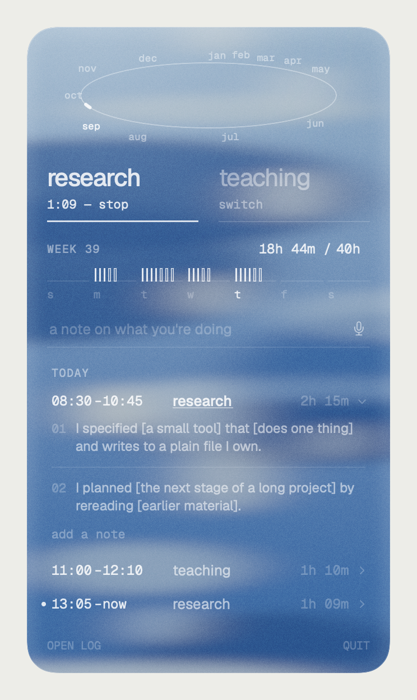

# Knolling

A small Mac app that lives in the menu bar and keeps track of your time across two kinds of work —
out of the box, research and teaching. Tap one when you start, tap it again when you stop, tap the
other to switch, as many times as the day needs. Every clock-in and clock-out, with any notes you
type or dictate, is written to one plain file on your own computer. It's Markdown by default; the
format lives in one file of code, so it could feed a spreadsheet instead.

Made by [**Caseysimone Ballestas**](https://caseysimone.com), a graduate student in mechanical
engineering at UC Berkeley. Built with [Claude Code](https://claude.com/claude-code) (Opus 5.5).



*The menu, rendered from the sample log in [`sample/`](sample/knolling.md). Every entry is a placeholder.*

**At a glance**

- A native macOS menu-bar app (SwiftUI), macOS 14 or later.
- Two kinds of work, one tap to start, stop, or switch; notes typed or dictated.
- One plain Markdown log as the only source of truth — readable, hand-editable, portable.
- Optional: an authored record of the Claude Code sessions you used, and their token counts.
- MIT licensed. No accounts, no server, no database.

---

## quick start

Requires macOS 14 or later and the Xcode Command Line Tools (Swift 5.10+). The menu is drawn as a
translucent pane; on macOS 26 it uses Apple's Liquid Glass, and on earlier versions a frosted
fallback.

```bash
git clone https://github.com/caseysimoneb/knolling.git
cd knolling
./build.sh
```

This builds, installs `~/Applications/Knolling.app`, and opens it; look for a small grid in the menu
bar. Knolling registers itself to start at login on first run (undo in System Settings → General →
Login Items). The log is written to `~/Documents/Knolling/knolling.md` unless you [choose another
place](#settings).

The Claude record and token counts are off until you turn them on — see [make it yours](#make-it-yours).

---

## why

As a graduate student in engineering, my time is split between research and teaching — in the same
week, often in the same afternoon. I didn't really see how it divided until a summer engineering
internship where I had to clock in and clock out. As someone critical of surveillance capitalism, I
actually found it really supportive: the small ritual of clocking in and out was organizing, even
animating. It gave the day a shape.
So I took that ritual and ran with it.

The name comes from **knolling**: the practice of laying objects out flat, at right angles, so you
can see everything at once and how the pieces relate. Tom Sachs made it a studio rule — *always be
knolling* — and this short film shows it better than any description:

<a href="https://www.youtube.com/watch?v=s-CTkbHnpNQ"></a>

*[10 Bullets, #8: "Always Be Knolling"](https://www.youtube.com/watch?v=s-CTkbHnpNQ), by Tom Sachs.*

Knolling does the same with time — every session laid out in one list, newest first, nothing hidden
in a database.

Most time trackers are built for billing: one clock-in, a lunch break, one clock-out. A split working
life doesn't work that way — it's a day of short stretches, switches, and returns. Knolling lets you
tap **research** or **teaching** whenever you start, tap again when you stop, and tap the other to
switch. Nothing else is required.

**Nothing depends on those two words.** Any life that divides between two kinds of work can be
knolled. Swap them for your own pair (they're the `Kind` enum in [`Log.swift`](Sources/Knolling/Log.swift)):

- work / family
- school / home
- making / admin
- writing / reading
- deep work / meetings
- paid / unpaid
- studio / client
- practice / performance
- learning / doing
- caring / creating

**And it should be beautiful.** I believe the things we use every day should be beautiful. I could
have used the default settings; instead I gave the menu a year shaped the way I feel time, a palette
from old cyanotypes, and a backdrop that changes every week. If you adapt it, play with it. Make it
yours with some joy.

## what it does

- **Two kinds, one tap.** Research or teaching. Tap the live one to stop; tap the other to switch.
- **Notes in your own words.** Type or dictate (on-device when your Mac supports it) while a
  session runs; notes always go to the session that's running, and when you clock out you can log
  one more for the session that just ended. Words are saved as you said them.
- **Sessions stay collapsed** until you click one open to see what was done in it.
- **Add a note after the fact.** Open any finished session and click *add a note*; it's stamped with
  when you wrote it. Your notes and Claude's records are numbered together, in order.
- **Any day this week.** Click a day in the week strip to see that day's sessions; click it again to
  come back to today.
- **Fix anything by hand.** Click any time in the menu to change it (`8`, `830`, `2pm` all work),
  or edit the log file directly — Knolling re-reads it and never overwrites your edits.
- **An hourly check-in that never pauses the clock.** Ignore it and the clock keeps running; it's
  only there for when you forget to clock out. It offers **Stop** and **Add note**; if you haven't
  seen it, a trailing `·` appears in the menu bar.
- **The menu bar stays quiet.** Off the clock it shows a small grid; live, `R 1:12` or `T 0:40`.
- **Nothing typed is lost.** Words typed but not entered when you tap a button are kept as a note.
  Click a note's words to rewrite them; clear them to remove the note.
- **Mis-taps disappear.** A start-then-stop under a minute with no notes is removed.
- **The week runs Sunday to Saturday**, with the hours so far against a weekly goal (40 by default;
  click the number to change it).

---

## design notes

**Time drawn the way it's felt.** The shapes in the menu come from temporal synesthesia — the
experience of time as having a place and shape in space:

- **The year is an oval**, seen in perspective, running clockwise over the top: September low on the
  left, winter bunched along the top, summer spread along the bottom — each month placed by hand, not
  spaced evenly. This week is a short lit stretch on it.
- **The week is flat.** Sunday to Saturday on one straight line — only a year arcs.
- **Within a day, time runs vertically**, so each hour worked is an upright tick, evenly spaced.
  The hour you're in counts as a whole tick. Research ticks are solid; teaching ticks are hollow.
- There is **no daily quota** drawn anywhere — no ring to fill, no day that is "full." There's one
  weekly goal (40 hours by default; click it to change it), shown as a number.

**Cyanotype.** The palette comes from 19th-century cyanotype survey photographs: Prussian blue
leaning cyan, with highlights the warm white of the paper. The menu is a pane of glass over its
own backdrop — pale forms seen through moving water, with a fine grain — drawn fresh each week
from the week number, so it holds up over whatever is behind it while letting a little show through.

**Type.** [Geist](https://vercel.com/font) for words and Geist Mono for times and labels, bundled
in the app. All times are 24-hour.

### your own year

The oval is drawn from one person's temporal synesthesia. If you experience time in space too and
your months sit somewhere else, redraw it:

1. Open [`design/year-oval.svg`](design/year-oval.svg) in Figma, Illustrator, or any SVG editor.
   Each month is a group: a dot where that month begins on the ring, and its label.
2. Move the dots and labels to where your months are. Bunch them, spread them — keep the ring itself
   as it is. Export as SVG (outlined text is fine).
3. Run `python3 scripts/oval-from-svg.py design/year-oval.svg --write`, then `./build.sh`.

Or hand the SVG to Claude Code and ask it to update the year oval from it; the script is the
deterministic version of that.

---

## make it yours

Knolling is built around a few things I value in how I work: noticing where the hours go, keeping a
record of what I did in my own words, being honest about what Claude did alongside me, and seeing
what that work took. They're mine, and they might not be yours — so each one is a switch. Turn off
anything that doesn't help you; the clock itself works the same either way.

| affordance | why it's there | on by default? | turn it on or off |
|---|---|---|---|
| **The Claude record** — a short, authored note of what you and Claude did, written at clock-out | so the record of your work includes the work you did with Claude, with credit where it belongs | off | `defaults write <bundle id> claudeNotes -bool true` (or `false`) |
| **Token counts** — a faint number on each session | to see what a stretch of work took, not just how long it lasted | off | `defaults write <bundle id> claudeTokens -bool true` (or `false`) |
| **The hourly check-in** — one quiet notification per hour | in case you forget to clock out; ignoring it changes nothing | on | `defaults write <bundle id> hourlyCheckIn -bool false` (or `true`) |
| **The weekly goal** — hours toward a number you choose | a gentle sense of the week, without a daily quota | 40 hours | click the number in the menu |
| **Starting at login** | so the clock is always there | on | System Settings → General → Login Items |

The Claude record and token counts are separate: you can keep one without the other. Both read the
Claude Code transcripts already on your Mac; only the record asks Claude to write anything, and only
through your own account.

The bundle id is `com.example.knolling` unless you set your own (see [settings](#settings)).

---

## how it's built

The log file is the only source of truth. Knolling holds no database and no cache of its own: the
menu re-reads the log on every change and every ten seconds, and every write re-reads the file,
changes only the line it needs, and writes it back — so hand edits are never overwritten.

| file | what it does |
|---|---|
| [`Log.swift`](Sources/Knolling/Log.swift) | the log format: parsing sessions and notes, and line-level writes (start, stop, notes, time edits) |
| [`Store.swift`](Sources/Knolling/Store.swift) | the app's state: sessions, the running session, week totals, the hourly check-in, edits from the menu |
| [`MenuView.swift`](Sources/Knolling/MenuView.swift) | the menu: year oval, the two kinds, the week strip, the note line, sessions |
| [`Panel.swift`](Sources/Knolling/Panel.swift) | the menu-bar item and the glass panel it opens |
| [`BlueField.swift`](Sources/Knolling/BlueField.swift) | the backdrop, generated each week from the week number |
| [`Scribe.swift`](Sources/Knolling/Scribe.swift) | the optional Claude record and token counts: reading transcripts, the queue of records owed, calling the `claude` CLI |
| [`Dictation.swift`](Sources/Knolling/Dictation.swift) | speech to text for notes |
| [`KnollingApp.swift`](Sources/Knolling/KnollingApp.swift) | startup, start-at-login, retries on wake and on reconnect, snapshot mode |

What's deterministic and what isn't is kept apart: times, durations, file lists, and token counts
come from code; only the sentences of the Claude record come from a model.

### the log

One Markdown file, newest first, readable anywhere:

```
- 2026-09-24  08:30–10:45  research  2h 15m
    - 10:45  [a note typed or dictated at clock-out]
    - record · I specified [a small tool] that [does one thing] and writes to a plain file I own.
        - Claude built [the parts], and tested them on a scratch file.
        - file: projects/example/notes.md
        - folder: projects/example
    - tokens · 148k new (output 24k · cache written 124k · input 54) · 4.1M with cache reads
- 2026-09-24  11:00–       teaching  running
```

Sessions are Markdown list items, so the file renders cleanly in Obsidian and still reads as plain
text. If you fix a time by hand, the duration is recomputed; the duration text on that line is for
reading, not counting, and may lag until you edit it.

### the Claude record (optional, off by default)

If you work with [Claude Code](https://claude.com/claude-code), Knolling can act as a quiet
secretary. At clock-out it reads the Claude Code sessions **you actively used while clocked in**
(only sessions where you sent a message inside that window, and only that slice of them) and adds
a short record under the session: a one-line glance shown in the menu, a few lines of detail in the
log, and the files Claude worked on. The file list comes from the session transcripts, not from a
model: files Claude wrote or edited in that window, plus files named in its shell commands that
changed during it. If Claude was still working at clock-out, the record says so.

The record is written to a style guide you own — [`RECORD-STYLE.md`](RECORD-STYLE.md) — built on a
simple grammar: every entry is **subject + predicate + context**, one act per sentence, and the
subject is always somebody: **I**, **Claude**, or another person. Judgment verbs (decided, framed,
chose) belong to you; execution verbs (drafted, built, searched) can be Claude's; and when an idea
came from Claude, the record says so. The point is a notebook where authorship stays legible.

With token counts on, each session also shows, faintly, how many tokens its Claude sessions used —
new work only (input, output, and cache written), not cache reads, which mostly measure how long a
conversation has run. The full breakdown is in the log, and shows when you open the session.

**Reliability.** A record is saved as *owed* the moment you clock out, so closing the laptop or
losing the connection only delays it: it's written once Knolling can reach Claude again (on wake,
when the network returns, on relaunch, or within a few minutes), exactly once. After a week, the
file list is written without a summary. Each summary gets three tries with a five-minute cutoff, and
every attempt is logged, with timings, in `~/Library/Logs/Knolling/scribe.log`.

It uses your own `claude` CLI (no tools, nothing saved as a session); you can limit it to one Claude
account with the settings below.

### settings

`defaults write <bundle id> <key> <value>`:

| key | what it does | default |
|---|---|---|
| `logPath` | where the log lives | `~/Documents/Knolling/knolling.md` |
| `weeklyGoalHours` | the weekly goal (also editable in the menu) | `40` |
| `claudeNotes` | turn the Claude record on | `false` |
| `claudeTokens` | show token counts per session | `false` |
| `hourlyCheckIn` | the hourly notification while a session runs | `true` |
| `claudeEmail` | only write records while the `claude` CLI is signed in as this account | any |
| `claudeAccountFolder` | only read desktop-app sessions from this account's folder | all |
| `recordStylePath` | your own style guide | the bundled `RECORD-STYLE.md` |

To build with your own bundle identifier, put `KNOLLING_BUNDLE_ID=com.you.knolling` in a `mine.env`
file next to `build.sh`. Build scratch goes to `~/Library/Caches/knolling-build`, outside iCloud.

---

## how it's verified

There's no automated test suite yet. Changes are checked three ways:

- **By image.** `Knolling --snapshot out.png -logPath sample/knolling.md -snapshotNow "2026-09-24 14:14"`
  renders the menu to an image, so a change can be seen before it ships. The screenshot above was
  made this way.
- **On scratch logs.** The log logic is exercised against throwaway copies — crossing midnight,
  switching kinds, hand edits, mis-taps, moved records — never against a real log.
- **By round trip.** `scripts/oval-from-svg.py` reproduces the year oval from its SVG exactly.

## known limitations

- macOS only, menu bar only. The Liquid Glass look needs macOS 26; earlier versions get a frosted fallback.
- Ad-hoc signed: you build it yourself, and macOS may ask for microphone and speech permission again
  after a rebuild.
- The two kinds are fixed in code (`Kind` in `Log.swift`).
- Claude work is attached to whichever session is running. If you forget to switch, move the record
  in the log by hand.
- The Claude record reads Claude Code transcripts only; regular claude.ai chats aren't stored on the
  Mac. The file list is a best guess for edits made through shell commands, and the sentences are
  written by a model — worth a glance.
- The week strip shows the current week; earlier weeks are in the log.

## future work

**Marking dates on the year.** The oval could also show what you're working toward: conference
deadlines, a talk, the end of a term, a submission date. Knolling doesn't do this yet, but the pieces
are there:

- `YearOval` in [`MenuView.swift`](Sources/Knolling/MenuView.swift) already turns any date into a
  spot on the ring (`position(of:)`, then `point(_:)`). That's how this week gets lit.
- A date could be drawn at its spot as a small tick or dot, with a short label, the same way the week
  segment is drawn. Past dates could fade; the next one could be brighter.
- The dates themselves could come from a plain file you keep, one per line
  (`2027-03-15  conference abstract due`), read the same way the log is. That keeps it portable and
  hand-editable. They could come from a calendar instead, at the cost of that simplicity.

If you build it, ask Claude Code something like: *"add upcoming dates from a dates file to the year
oval, as small ticks with labels."* The pointer in `YearOval` marks where it goes.

## privacy

The log is a local file on your Mac. Dictation runs on-device when your Mac supports it; otherwise it
uses Apple's speech recognition. Nothing else is sent anywhere unless you turn on the Claude record,
which uses your own Claude account. Token counts are read from files already on your Mac.

## license

Code: MIT — see [`LICENSE`](LICENSE). Fonts: Geist and Geist Mono, SIL Open Font License
([`Fonts/OFL.txt`](Fonts/OFL.txt)).
